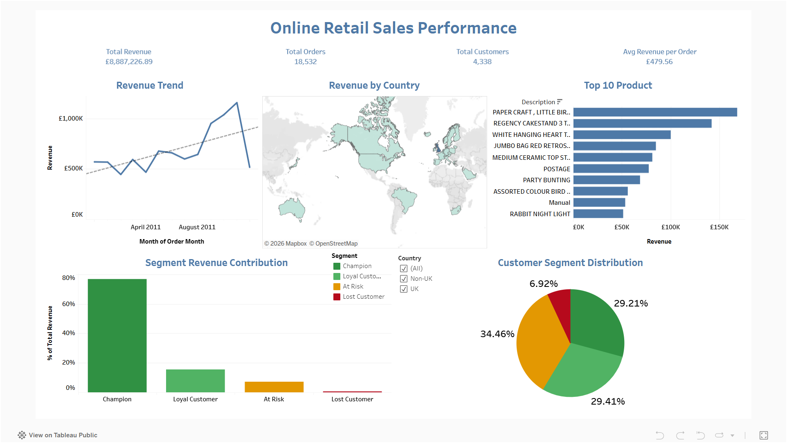

# Online-Retail-Sales-Performance-Analysis

End-to-end data analysis project menggunakan dataset transaksi retail online, mencakup data cleaning, exploratory data analysis, customer segmentation (RFM), business query, hingga interactive dashboard.

**Live Dashboard:** [Tableau Public — Online Retail Sales Performance Analysis](https://public.tableau.com/views/OnlineReatailSalesPerformanceAnalysis/Overview)

---

## Business Question

Bagaimana pola pembelian customer dan performa produk pada bisnis retail online, serta customer segment mana yang paling bernilai untuk strategi retensi dan pertumbuhan revenue?

## Dataset

[Online Retail II Dataset](https://www.kaggle.com/datasets/mashlyn/online-retail-ii-uci) (Kaggle) — data transaksi retail online periode Desember 2010 – Desember 2011, mencakup ±390.000 baris transaksi dari customer di berbagai negara.

## Tools & Workflow

| Tahap | Tools | Deliverable |
|---|---|---|
| Initial exploration | Excel | Pivot table awal, sniff test data |
| Data cleaning & EDA | Python (pandas, matplotlib, seaborn) | Jupyter Notebook |
| Business query & segmentation | MySQL | SQL query file (window functions, CTE) |
| Dashboard & visualisasi | Tableau | Interactive dashboard (2 layer) |

**Alur kerja saya:** Excel (untuk eksplorasi cepat) → Python (untuk cleaning + EDA + RFM) → MySQL (untuk business query lanjutan) → Tableau (membuat dashboard interaktif untuk end-user).

---

## Key Insights

1. **Revenue sangat terkonsentrasi di UK** \
United Kingdom menyumbang **82% dari total revenue** (£7,28 juta), jauh di atas negara kedua (Netherlands, £285rb). Ini menunjukkan basis pelanggan masih sangat domestik dan membuka peluang ekspansi ke Netherlands/Eire/Germany.

2. **Prinsip Pareto terbukti kuat pada basis customer** \
Hasil RFM segmentation menunjukkan segmen **"Champion"** memiliki customer sebanyak 1.267 dari 4.338 customer (29%), tapi menyumbang **76,8% dari total revenue**. Sebaliknya, **"Lost Customer"** (300 orang) hanya menyumbang 0,5% revenue. Fokus retensi sebaiknya diarahkan ke segmen Champion & Loyal Customer.

3. **Pola musiman jelas menjelang Q4** \
Revenue naik signifikan dari Agustus (£644rb) ke November (**puncak tertinggi, £1,15 juta**), konsisten dengan pola belanja musim liburan.

4. **Tidak ada transaksi di hari Sabtu** \
Pola order tersebar di hari Senin–Jumat dengan sedikit transaksi di hari Minggu, mengindikasikan karakteristik bisnis ini kemungkinan B2B/wholesale, bukan retail konsumen harian biasa.

5. **Produk gift/homeware mendominasi penjualan** \
Item seperti "PAPER CRAFT LITTLE BIRDIE" dan "REGENCY CAKESTAND 3 TIER" menjadi kontributor revenue tertinggi, konsisten dengan positioning bisnis sebagai penjual barang dekorasi/gift.

---

## Dashboard Preview



Dashboard terdiri dari 2 layer:
- **Overview** — KPI summary, tren revenue bulanan, peta revenue per negara, top produk, distribusi customer segment
- **Detail View** — drill-down interaktif: klik negara/segment/bulan di Overview untuk melihat detail produk, daftar customer per segment, dan breakdown harian

Coba langsung di **[Tableau Public](https://public.tableau.com/views/OnlineReatailSalesPerformanceAnalysis/Overview)**

---

## Metodologi Analisis

### Data Cleaning (Python)
- Membuang transaksi tanpa `CustomerID` (guest checkout)
- Memisahkan transaksi retur (`Quantity` negatif) dari transaksi sales (bukan retur)
- Validasi `Price` untuk membuang data yang tidak valid
- Menghapus duplikat baris

### RFM Segmentation
Customer disegmentasi berdasarkan **Recency** (seberapa baru transaksi terakhir), **Frequency** (jumlah order), dan **Monetary** (total spending), menghasilkan 4 segmen: Champion, Loyal Customer, At Risk, Lost Customer.

Analisis ini dilakukan dua kali — di **Python** (`pd.qcut`) dan **MySQL** (`NTILE()` + CTE + window function) — untuk menunjukkan implementasi logika yang sama di dua tools berbeda. Ditemukan sedikit perbedaan hasil pada beberapa customer akibat perbedaan metode binning quartile (`qcut` berbasis distribusi nilai vs `NTILE` berbasis jumlah baris), sebuah detail teknis yang wajar terjadi dan didokumentasikan sebagai bagian dari proses analisis.

### Business Query (MySQL)
Query mencakup: KPI summary, top produk per negara (window function `RANK()`), kontribusi revenue per customer segment, pola transaksi per hari, dan month-over-month growth rate (`LAG()`).

---

## Struktur Repository

```
retail-sales-analysis/
├── README.md
├── notebooks/
│   └── online_retail_analysis.ipynb
├── sql/
│   └── retail_analysis_queries.sql
└── images/
    └── dashboard_overview.png
```

> Catatan: raw data tidak diupload ke repository ini karena ukuran file besar. Dataset dapat diunduh langsung dari [link Kaggle di atas](https://www.kaggle.com/datasets/mashlyn/online-retail-ii-uci).

---

## Kontak

**Ahmad Fadillah Firdaus**
ahmadfadillahfirdaus@gmail.com | [LinkedIn](https://www.linkedin.com/in/ahmadfadillahfirdaus/) | [Tableau Public Profile](https://public.tableau.com/app/profile/ahmad.fadillah.firdaus/vizzes)
